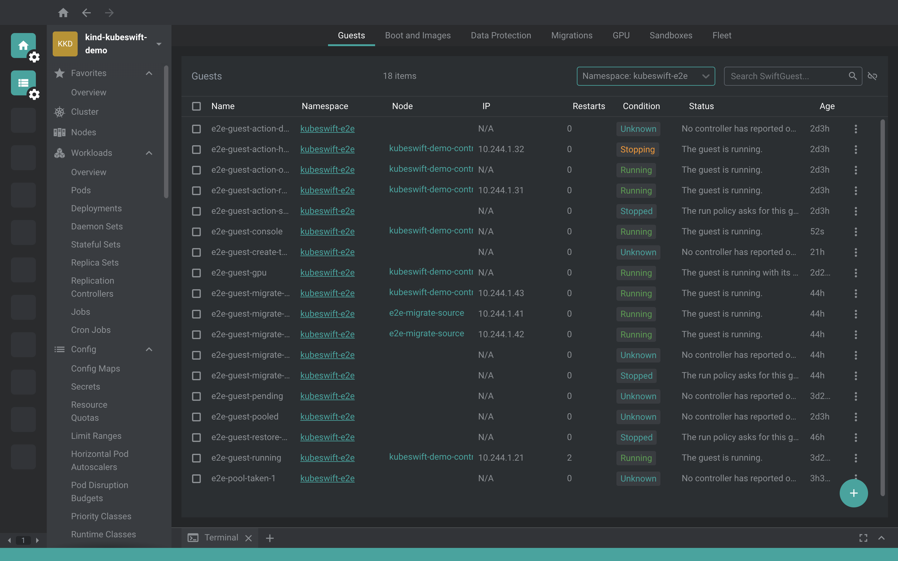

# @freelensapp/kubeswift-extension

<!-- markdownlint-disable MD013 -->

[](https://freelens.app)
[](https://github.com/freelensapp/freelens-kubeswift-extension)
[](https://deepwiki.com/freelensapp/freelens-kubeswift-extension)
[](https://github.com/freelensapp/freelens-kubeswift-extension/releases)
[](https://github.com/freelensapp/freelens-kubeswift-extension/actions/workflows/unit-tests.yaml)
[](https://github.com/freelensapp/freelens-kubeswift-extension/actions/workflows/integration-tests.yaml)
[](https://github.com/freelensapp/freelens-kubeswift-extension/actions/workflows/e2e-tests.yaml)
[](https://www.npmjs.com/package/@freelensapp/kubeswift-extension)

<!-- markdownlint-enable MD013 -->

## Overview

[Freelens](https://freelens.app) extension for
[KubeSwift](https://github.com/kubeswift-io/kubeswift), the Kubernetes-native
virtual machine runtime.

The extension covers every KubeSwift custom resource — all 15 kinds across 9
API groups — with list pages, detail drawers, lifecycle actions, creation
forms, and consoles, grouped in the cluster sidebar under **Guests**, **Boot
and Images**, **Data Protection**, **Migrations**, **GPU**, **Sandboxes**,
and **Fleet**.



The extension is CRD-native: it reads and writes the resources directly
through the Kubernetes API of the cluster you are connected to, with no
dependency on the KubeSwift UI gateway. It is also a from-scratch
implementation: the KubeSwift repositories are AGPL-3.0 and are used only as
a visual and domain reference, while every view here is MIT and reimplements
the behavior against the published CRD schemas (see
[ARCHITECTURE.md](docs/development/ARCHITECTURE.md) for the licensing
boundary).

## Requirements

- **Freelens >= 1.10.3.**
- **Kubernetes >= 1.24.**
- **KubeSwift v0.13.x.** The views track the v0.13.12 CRDs. The upstream API
  is `v1alpha1` and may change between KubeSwift releases; the extension
  follows.
- **Node.js** is required only when building the extension from source; it
  is not needed to run it.

## Supported APIs

All resources are `v1alpha1`.

| API group | Kinds |
| --- | --- |
| `swift.kubeswift.io` | SwiftGuest, SwiftGuestClass, SwiftGuestPool |
| `image.kubeswift.io` | SwiftImage |
| `seed.kubeswift.io` | SwiftSeedProfile |
| `kernel.kubeswift.io` | SwiftKernel |
| `gpu.kubeswift.io` | SwiftGPUProfile, SwiftGPUNode |
| `snapshot.kubeswift.io` | SwiftSnapshot, SwiftRestore, SwiftSnapshotSchedule |
| `migration.kubeswift.io` | SwiftMigration |
| `sandbox.kubeswift.io` | SwiftSandbox, SwiftSandboxPool |
| `fleet.kubeswift.io` | Cluster |

## Installation

Once published, install from the Freelens **Extensions** page
(`ctrl`+`shift`+`E` or `cmd`+`shift`+`E`) by npm name:

```text
@freelensapp/kubeswift-extension
```

Alternatively, download the `.tgz` from the
[GitHub releases](https://github.com/freelensapp/freelens-kubeswift-extension/releases)
page and drag it into the Freelens window, or provide its path on the
Extensions page.

You can also build and pack the extension yourself — see
[Build from the source](#build-from-the-source).

## Getting started

1. Connect to a cluster where KubeSwift is installed. The KubeSwift entry
   appears in the cluster sidebar.
2. Check the namespace filter: KubeSwift resources live in their own
   namespaces, and a freshly connected Freelens shows only `default`.
3. No KubeSwift cluster at hand? One command spins up a local demo cluster
   with realistic simulated fixtures, no KVM needed — see
   [TRY-IT.md](docs/development/TRY-IT.md).

## Features

### Views

Every kind gets a list page and a detail drawer: sortable and searchable
columns, phase and condition badges with consistent status semantics,
cross-links between related objects (guest to node, pod, class, snapshot,
GPU profile, and so on), and full support for both Freelens themes.

### Guest lifecycle

Start and Stop live in the row kebab and in the drawer toolbar. Nothing
happens on a single click: every action opens a dialog that lists the exact
API calls it is about to make, and cancelling writes nothing. Disabled
actions state their reason, and a stop that only half-succeeds tells you
what did and did not happen.

### Data protection

Take Snapshot (with its four storage backends), Restore (in place or as a
clone), snapshot schedules, and delete dialogs that read back what will
actually happen to the data before you confirm.

### Migrations

Start Migration with a node picker, a prediction of the effective mode, and
a client-side guard against the auto-to-live trap on `ReadWriteOnce`
storage, where a live migration would put two pods on the same volume.

### Creation forms

Create dialogs for guests (image, kernel, or clone boot, with data disks,
network and port exposure, and GPU sections), guest classes, images,
kernels, seed profiles, guest pools (with the full guest template embedded),
sandboxes, and sandbox pools. Forms validate against the CRD rules as you
type, send explicit payloads, and never overwrite an existing object on a
name clash.

### Consoles

The VM serial console opens in a Freelens terminal tab. A sandbox exposes a
read-only console tail (the hypervisor writes a sandbox's serial line to a
file by construction). An interactive shell inside a sandbox microVM is
deliberately not offered: that channel is the guest agent's vsock protocol,
which belongs to the upstream AGPL gateway — use `swiftctl sandbox attach`
from a terminal instead.

## Limits

- Statuses come from the KubeSwift controllers. On a cluster without them
  (such as the local demo cluster) statuses are simulated and frozen.
- Behavior against real KVM-backed virtual machines has a manual test track
  of its own; see [TESTING.md](docs/development/TESTING.md).

## Development

The repository is developed spec-first, with the specs in the repository:

- [ROADMAP.md](docs/development/ROADMAP.md) — the milestones toward v1.0.0
- [PROCESS.md](docs/development/PROCESS.md) — the spec-driven workflow
- [ARCHITECTURE.md](docs/development/ARCHITECTURE.md) — CRD-native design
  and the licensing boundary
- [DESIGN.md](docs/development/DESIGN.md) — the UI and UX directives
- [TESTING.md](docs/development/TESTING.md) — the test layers every feature
  ships with
- [TRY-IT.md](docs/development/TRY-IT.md) — the local demo cluster for
  manual testing
- [docs/specs/](docs/specs/) — one spec per feature

## Build from the source

You can build the extension from this repository.

### Prerequisites

Use [NVM](https://github.com/nvm-sh/nvm),
[mise-en-place](https://mise.jdx.dev/), or
[windows-nvm](https://github.com/coreybutler/nvm-windows) to install the
required Node.js version.

From the root of this repository:

```sh
nvm install
# or
mise install
# or
winget install CoreyButler.NVMforWindows
nvm install 24.15.0
nvm use 24.15.0
```

Install pnpm:

```sh
corepack install
# or
curl -fsSL https://get.pnpm.io/install.sh | sh -
# or
winget install pnpm.pnpm
```

### Build extension

```sh
pnpm i
pnpm build
pnpm pack
```

One script to build and pack the extension for testing:

```sh
pnpm pack:dev
```

### Install built extension

The tarball will be placed in the current directory. In Freelens, navigate
to the Extensions page and provide the path to the tarball, or drag and
drop the `.tgz` file into the Freelens window.

### Check code statically

```sh
pnpm lint:check
```

or

```sh
pnpm trunk:check
```

and

```sh
pnpm build
pnpm knip:check
```

### Testing the extension with unpublished Freelens

In the Freelens working repository:

```sh
rm -f *.tgz
pnpm i
pnpm build
pnpm pack -r
```

Then in the extension repository:

```sh
echo "overrides:" >> pnpm-workspace.yaml
for i in ../freelens/*.tgz; do
  name=$(tar zxOf $i package/package.json | yq -r .name)
  echo "  \"$name\": $i" >> pnpm-workspace.yaml
done

pnpm clean:node_modules
pnpm build
```

## License

Copyright (c) 2025-2026 Freelens Authors.

[MIT License](https://opensource.org/licenses/MIT)
